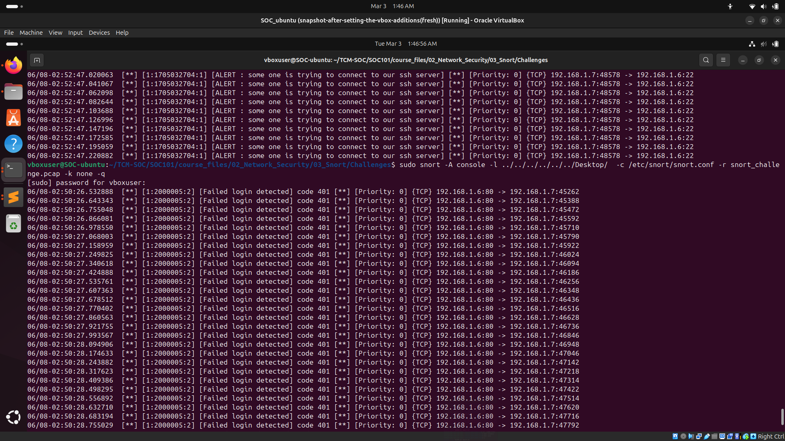
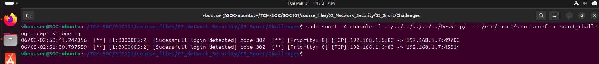
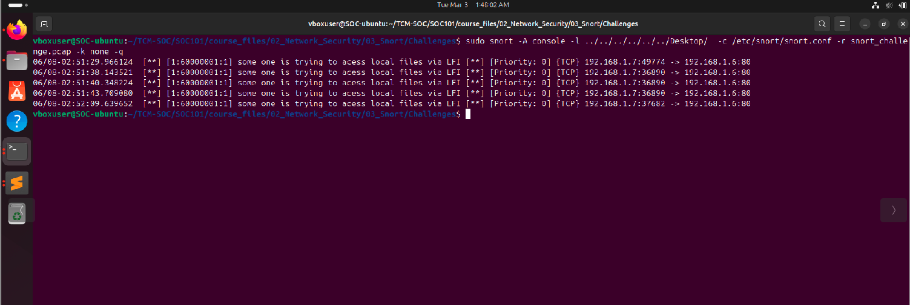
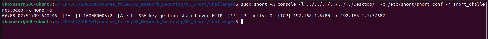
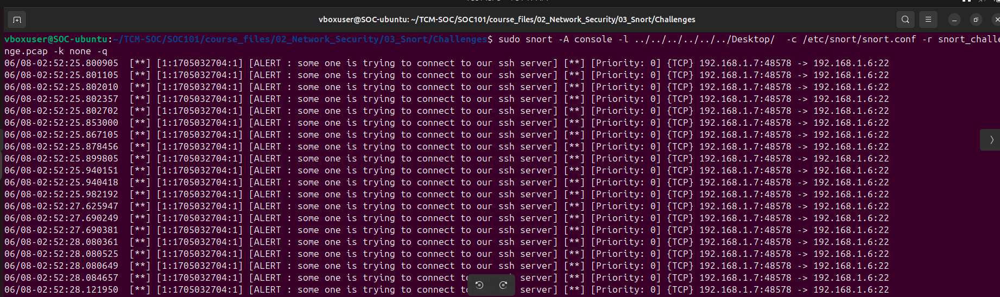
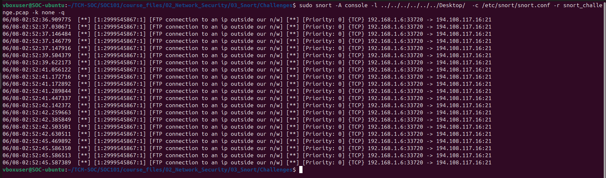

### TITLE
## DETECTION OF BruteForce on a web page & stealing the ssh key along with confidential files due to LFI 

## SUMMARY
1) The Pcap had an abnormal amout of unauth [code 401] response from the server
2) Right after the brute Force attacker exploited the LFI 
3) Gained access to ssh key
4) made an ssh connection connected to an FTP server and did DATA Exfiltiration

## LAB ARCHITECTURE
This Lab didn't required an Lab configuration it was just an simulation of an pcap using snort

##  Attack chain :-
	" Brute Force → Admin Panel Access → LFI → Credential Extraction → SSH Login → FTP Exfiltration "

## DETECTION LOGIC

There are several Rule used in this lab 
For http brute force :-

	"#alert tcp any 80 -> any any (msg:"[Failed login detected] code 401";flow:to_client,established;content:"401";http_stat_code;threshold:type threshold, track by_dst, count 10, seconds 30;sid:2000005;rev:2;)"

For detecting sucessfull login attempt :-

	"#alert tcp any 80 -> any any (msg:"[Sucessfull login detected] code 302 ";flow:to_client,established;content:"302";http_stat_code;sid:3000005;rev:2;)"

For detecting LFI :-

	"alert tcp any any -> any 80 ( msg:"some one is trying to acess local files via LFI"; flow:to_server,established;content:"../";http_uri;sid:60000001; rev:1; ) "

For detecting stealing of ssh key :- 
	
	"alert tcp any any -> any 80 ( msg:"some one is trying to acess local files via LFI"; flow:to_server,established;content:"id_rsa";http_uri;sid:100000001; rev:1; ) "

	" alert tcp any 80 -> any any (msg:"[Failed login detected] code 401";flow:to_client,established ;file_data;content:"|2D 2D 2D 2D 2D 42 45 47 49 4E 20 4F 50 45 4E 53 53 48 20 50 52 49 56 41 54 45 20 4B 45 59 2D 2D 2D 2D 2D|";depth:40 ;sid:100000005;rev:2;)"

For detecting if some one is trying to make an connnection to our ssh server :-
	
	"alert tcp any any -> any 22 (msg:"[ALERT : some one is trying to connect to our ssh server]"; sid : 6000000000; rev : 1;)"

For detecting of making an outbound connection to an FTP server :- 

	"alert tcp any any -> !192.168.1.0/24 21 (msg:"[FTP connection to an ip outside our n/w]"; sid : 6000000000; rev : 1;)"

## EVIDENCE & VALIDATION

1) HTTP :- 

2) CODE 302 :- 

3) LFI vuln :- 

4) SSH KEY :- 

5) SSH connection :-

6) FTP connection to an external IP :-

 
